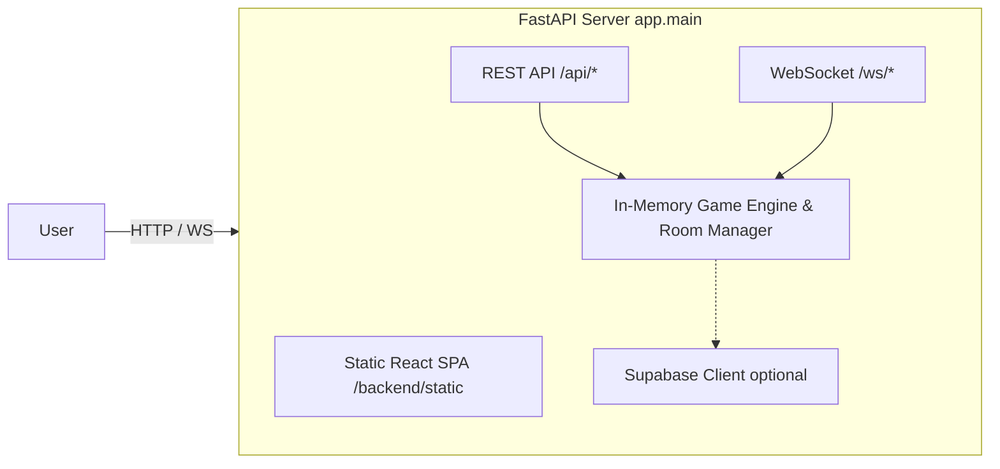

# Kadi Teeri Online

A real-time, multiplayer web application for playing the Indian trick-taking card game **Kadi Teeri**. The application features room-based matchmaking, real-time synchronized game state via WebSockets, and resilient connection handling.

---

## Overview

Kadi Teeri Online allows 4 to 12 players to create or join private rooms to play Kadi Teeri with friends. It fully implements the game's core rules, including bidding, trump selection, trump challenge duels, partner (Bheru) calling (`SIMPLE`, `FIX`, `BOTH`, `SECOND` modes), trick-taking validation, 2-deck duplicate card win resolution, and scoring.

---

## Features

- **Room-Based Matchmaking**: Create private rooms with a shareable 4-character room code.
- **Flexible Configuration**: Supports 4 to 12 players and 1 or 2 card decks.
- **Real-Time Gameplay**: Synchronized game state across all clients with WebSockets.
- **Resilient Connections**: Reconnection handling that restores player hands and state if disconnected.
- **Trump Challenge Window**: 10-second countdown for opponents to challenge bids and initiate bid duels.
- **Bheru Modes**: 1-deck simple partner calls + 2-deck advanced modes (`FIX`, `BOTH`, `SECOND`).
- **Responsive 3D/2D UI**: Integrated React SPA with felt game table aesthetics.

---

## Architecture

Kadi Teeri Online is built as a single deployable monolithic web application.



---

## Project Structure

```text
kadi-teeri/
├── backend/
│   ├── app/               # Core application package
│   │   ├── main.py        # FastAPI app initialization, CORS & SPA route handler
│   │   ├── config.py      # Application configuration settings
│   │   ├── api/           # HTTP REST & WebSocket endpoint routers
│   │   ├── models/        # Pydantic schemas & state domain models
│   │   ├── services/      # Room management & WebSocket connection services
│   │   ├── db/            # Supabase database client integration
│   │   └── game/          # Kadi Teeri domain rules engine (deck, bidding, trump, bheru, trick, scoring)
│   ├── tests/             # Pytest test suite
│   │   ├── unit/          # Unit tests for game rules and mechanics
│   │   ├── integration/   # Integration & API tests
│   │   └── conftest.py    # Shared test fixtures
│   ├── main.py            # Facade entry point for uvicorn
│   └── requirements.txt   # Backup requirements file
├── frontend/
│   ├── src/
│   │   ├── features/      # Game phase feature pages
│   │   ├── components/    # UI elements (card, table, player, ui)
│   │   ├── store/         # Zustand global game state store
│   │   ├── hooks/         # Custom hooks (useWebSocket, useSoundEffects)
│   │   └── types/         # TypeScript definitions
│   ├── package.json
│   └── vite.config.ts
├── docs/                  # Engineering documentation
│   ├── CODE_RULES.md
│   ├── DATABASE.md
│   ├── ARCHITECTURE.md
│   ├── DEVELOPMENT.md
│   ├── DEPLOYMENT.md
│   └── TESTING.md
├── Dockerfile             # Multi-stage production container setup
├── pyproject.toml         # Python uv dependency & tool configuration
└── uv.lock                # Deterministic lockfile
```

---

## Technical Stack

| Layer | Technology | Purpose |
|---|---|---|
| **Frontend** | React 19 / Vite | User Interface |
| **State** | Zustand | Client-side State Management |
| **Backend** | FastAPI | REST API & WebSocket Server |
| **Dependency Mgr** | `uv` | Python dependency locking & virtual environments |
| **Validation** | Pydantic | Data schemas & validation |
| **Networking** | WebSockets | Real-time state synchronization |

---

## Prerequisites

- **Node.js** (v18+)
- **Python** (3.10+) with `uv` installed

---

## Quick Start (Local Development)

### 1. Clone the repository
```bash
git clone <repository-url>
cd kadi-teeri
```

### 2. Start the Backend
```bash
# Install dependencies with uv
uv sync

# Run backend development server
uv run uvicorn backend.app.main:app --reload --port 8000
```

### 3. Start the Frontend
```bash
cd frontend
npm install
npm run dev
```

Open `http://localhost:5173` in your browser.

---

## Combined Production Run

To test the unified single-process application locally:

```bash
# Build frontend static files into backend/static
cd frontend
npm run build
cd ..

# Run backend
uv run uvicorn backend.app.main:app --port 8000
```

Open `http://localhost:8000` in your browser.

---

## Environment Variables

| Variable | Required | Description | Default |
|---|:---:|---|---|
| `PORT` | No | Server port | `8000` |
| `SUPABASE_URL` | No | Supabase database API URL | In-memory fallback |
| `SUPABASE_KEY` | No | Supabase database anon key | In-memory fallback |
| `VITE_API_URL` | No | Frontend REST API base URL | Window origin |
| `VITE_WS_URL` | No | Frontend WebSocket base URL | Window origin |

---

## Testing

### Backend Tests
```bash
uv run pytest backend/tests
```

### Frontend Tests
```bash
cd frontend
npm test
```

---

## Engineering Documentation

Detailed engineering documentation is available in the `docs/` directory:

- [CODE_RULES.md](file:///d:/Code_PlayGround/kadi-teeri/docs/CODE_RULES.md): Coding standards, linting rules, styling conventions.
- [DATABASE.md](file:///d:/Code_PlayGround/kadi-teeri/docs/DATABASE.md): State model, Supabase schema, JSON serialization.
- [ARCHITECTURE.md](file:///d:/Code_PlayGround/kadi-teeri/docs/ARCHITECTURE.md): System architecture, WebSocket protocol, game lifecycle.
- [DEVELOPMENT.md](file:///d:/Code_PlayGround/kadi-teeri/docs/DEVELOPMENT.md): Local development workflow with `uv` and Vite.
- [DEPLOYMENT.md](file:///d:/Code_PlayGround/kadi-teeri/docs/DEPLOYMENT.md): Render deployment and Docker configuration.
- [TESTING.md](file:///d:/Code_PlayGround/kadi-teeri/docs/TESTING.md): Backend and frontend test coverage details.
